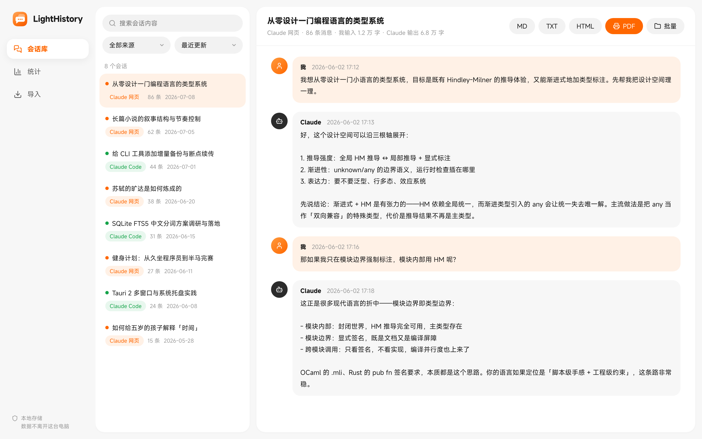
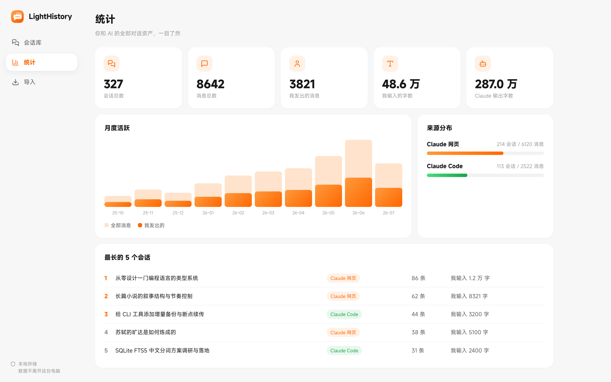
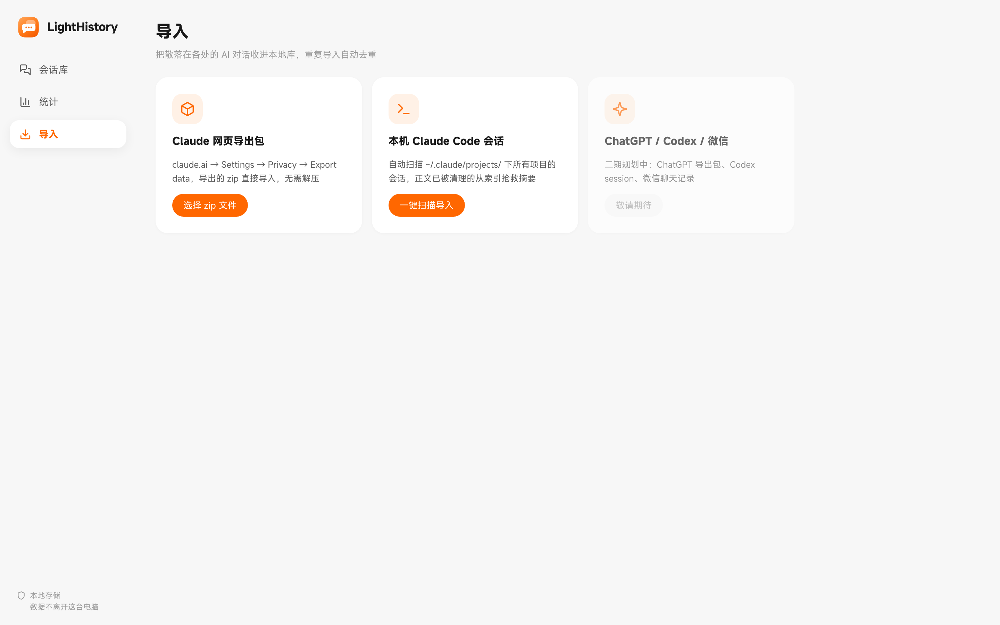

<div align="center">


# LightHistory

**本地优先的 AI 对话资产管理器 · Local-first AI Chat History Manager**

账号是平台的，对话是你的。<br/>
把 Claude、Claude Code（未来还有 ChatGPT、Codex、微信）的对话记录收归本地——永久留存、全文检索、随时导出。

[](https://creativecommons.org/licenses/by-nc/4.0/)
[](https://tauri.app)
[](https://vuejs.org)
[](https://www.rust-lang.org)
[](#-快速开始)
[](#-贡献)

[功能](#-功能特性) · [截图](#-界面预览) · [快速开始](#-快速开始) · [路线图](#-路线图) · [English](#english)

</div>

---

## 💡 为什么需要它

你和 AI 的每一次深度对话，都是思考的沉淀。但这些数据有三重风险：

- **封号即清零** — claude.ai 账号被封，网页对话无法再访问
- **平台会清理** — Claude Code 会定期删除本地会话正文，只留一行索引
- **数据在别处** — 服务关停、政策变更、区域限制，都不由你决定

LightHistory 把它们统统收进你自己电脑上的 SQLite——**数据不经过任何服务器，不离开这台机器**。

## 📸 界面预览

<div align="center">

**会话库 · 全文检索 · 对话还原**



| 数据统计 | 多源导入 |
| :---: | :---: |
|  |  |

</div>

## ✨ 功能特性

| | 功能 | 说明 |
|---|------|------|
| 📦 | **导入 claude.ai 导出包** | 官方 Export data 的 zip 直接导入，无需解压 |
| ⌨️ | **导入 Claude Code 会话** | 一键扫描 `~/.claude/projects/`，按项目归档 |
| 🚑 | **索引抢救** | 正文已被 Claude Code 清理的会话，自动从 `sessions-index.json` 抢回摘要与首条提问 |
| 🔍 | **中文全文检索** | SQLite FTS5 + CJK 分词，命中高亮、直接定位到具体消息 |
| 🔁 | **增量去重** | 重复导入自动跳过未变化的会话，只更新有变动的 |
| 📄 | **多格式导出** | 单会话 Markdown / TXT / HTML / 打印 PDF，支持全库批量导出 |
| 📊 | **数据统计** | 会话数、消息数、**你输入的字数**、月度活跃、来源分布、最长会话榜 |
| 🔒 | **本地优先** | 无网络请求、无遥测、无账号，数据 100% 在本地 |

## 🚀 快速开始

### 下载安装

从 [Releases](../../releases) 下载对应平台的安装包（macOS `.dmg` / Windows `.msi` / Linux `.deb`）。

### 从源码构建

```bash
# 环境要求：Node.js 18+ / pnpm / Rust 1.77+
git clone https://github.com/yzfly/LightHistory.git
cd LightHistory
pnpm install
pnpm tauri dev     # 开发模式
pnpm tauri build   # 打包安装程序
```

### 三步收下你的对话

1. **Claude 网页**：claude.ai → Settings → Privacy → **Export data**，收到邮件后下载 zip → 在 LightHistory「导入」页选择该 zip
2. **Claude Code**：「导入」页点击**一键扫描导入**
3. 完成。去「会话库」搜索、阅读、导出，去「统计」看看你和 AI 聊了多少万字

> 💡 建议养成习惯：每月导出一次 claude.ai 数据包并导入，防患于未然。

## 🏗 架构设计

```
┌────────────────────────────────────────────────┐
│                 Vue 3 + TypeScript             │
│        会话库 · 全文检索 · 统计 · 导入          │
├────────────────────────────────────────────────┤
│                Tauri 2 IPC (Rust)              │
├──────────────┬──────────────┬──────────────────┤
│   Importers  │   Exporters  │      Stats       │
│  (适配器模式) │  MD/TXT/HTML │   SQL 聚合分析    │
├──────────────┴──────────────┴──────────────────┤
│         SQLite + FTS5（CJK 分词全文索引）        │
│    统一模型：来源 → 会话 → 消息 + 原始数据留存    │
└────────────────────────────────────────────────┘
```

所有平台的数据归一化到「来源 → 会话 → 消息」三层模型；接入新平台只需新增一个 importer，核心不动。

## 🗺 路线图

- [x] Claude 网页导出包导入
- [x] Claude Code 本地会话导入（含索引残存抢救）
- [x] 中文全文检索 / 多格式导出 / 数据统计
- [ ] ChatGPT 官方导出包导入
- [ ] Codex session 会话记录导入
- [ ] 微信聊天记录的保存与分析（参考 [CipherTalk](https://github.com/ILoveBingLu/CipherTalk)）
- [ ] 标签、收藏与笔记
- [ ] 定时自动扫描增量备份
- [ ] 全库一键加密备份与恢复

## 🤝 贡献

欢迎 Issue 与 PR：

- 新平台的 importer（数据样例 + 解析逻辑）
- 检索体验优化（分词、排序、过滤器）
- 界面与交互打磨

## 📄 协议

[CC BY-NC 4.0](https://creativecommons.org/licenses/by-nc/4.0/deed.zh)（署名-非商业性使用）。商业授权请联系作者。

## 👤 作者

**云中江树** — 微信公众号「**云中江树**」

如果这个项目帮你保住了对话资产，点个 ⭐ 让更多人看到它。

---

<div align="center">

### English

**LightHistory** is a local-first desktop app for archiving, searching and exporting your AI chat history — Claude.ai exports and Claude Code sessions today; ChatGPT, Codex and WeChat coming next. Built with Tauri 2 (Rust) + Vue 3, full-text search powered by SQLite FTS5 with CJK tokenization. Your conversations never leave your machine.

**Keywords**: AI chat history manager · Claude export tool · Claude Code session backup · conversation archive · full-text search · Tauri desktop app

</div>
